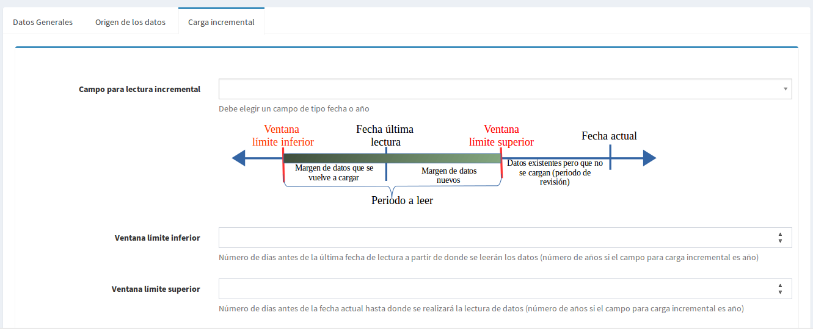

# ETL
El bloque ETL (Extract Transform Load) es la sección dónde se configuran los orígenes de datos y se obtiene la información de ellos.

## Conexión a bases de datos
Cuando los datos provienen de una base de datos ya existente, se debe configurar antes la conexión a ésta. Los motores soportados son: PostgreSQL, MySQL, SQL Server y Oracle.

Debemos ingresar los datos necesarios para configurar la conexión, una vez ingresados se puede probar la conexión con el botón **Probar Conexión** el cual nos devolverá un mensaje con el resultado de la prueba.

## Origen de datos
Para la creación de un origen de datos tenemos dos secciones: Datos generales que contendrá la descripción general del origen y **Origen de los datos** donde especificará si los datos se obtendrán desde una conexión a una base de datos o desde un archivo.

En la sección de datos generales debemos especificar:
- El nombre del origen de datos
- Opcionalmente una descripción
- Si el origen de datos lo utilizaremos para cargar datos de tablas catálogos. De ser así, el origen de datos se guardará en una tabla *nombre_origen_ctl*, estas tablas pueden ser usadas posteriormente para enlazar campos que sean llaves foráneas.
- El área en que se usará, esto determinará cómo será almacenado, la cantidad de áreas puede variar, si se desea guardar en el área por defecto debe dejar esta opción vacía.

De las últimas dos secciones debemos seleccionar la que utilizaremos según el caso. Para cargar datos desde una sentencia SQL debemos seleccionar la conexión a la base de datos y especificar la sentencia SQL para extraer los datos, es recomendable probar la sentencia antes de guardarla con el botón **Probar Sentencia SQL** la cual mostrará un mensaje con el resultado de la prueba y un listado de datos de muestra en el caso que ejecución de la sentencia haya sido exitosa.

Y para cargar datos desde un archivo, debemos especificar la ruta del archivo, el cual puede ser una hoja electrónica (Excel hasta versión 2010 y OpenOffice/LibreOffice hasta versión 3.5 son soportados) o desde un archivo de texto con formato de valores separados por comas (CSV).

#### Configuración de un origen de datos
Al especificar las opciones necesarias en el formulario de origen de datos y guardarlo se cargará una nueva sección en la parte inferior del formulario, por medio de la cual debemos configurar los datos obtenidos.

Es de suma importancia realizar esta configuración correctamente. Debemos especificar para cada campo su significado y si usará un diccionario de transformación.

El diccionario de transformación es un grupo de reglas para convertir un dato en otro, esto se podría usar en el caso de que se desee leer dos orígenes de datos pero el campo en cada uno de ellos utiliza valores diferentes, supongamos que el campo es sexo y que en un origen de datos femenino se representa por F y masculino por M; pero en el otro origen de datos femenino se representa por 1 y masculino por 2; en este caso será necesario transformar los valores de uno de los orígenes para que coincida con el otro.

El significado del campo determinará qué es lo que almacenará y por medio de éste se permitirá luego relacionar campos de diferentes orígenes de datos, un tipo de campo solo se puede aparecer una vez en cada origen de datos. Un campo con especial importancia es el **Campo para cálculos** el cual identificará el campo que se utilizará para realizar los cálculos dentro de la fórmula del indicador.

#### Carga incremental
Por defecto cada vez que se lee un origen de datos se hace una lectura completa, sustituyendo los valores de lecturas anteriores, si la cantidad de datos es muy grande puede ser más conveniente hacer cargas incrementales, la cual consiste en leer los datos a partir del punto en que fueron leidos en una lectura anterior y así cargar solamente los datos nuevos

Para configurar la carga incremental tiene que especificar tres opciones:
- El campo que se usará como punto de control de la carga incremental, debe ser un campo de tipo fecha o año. Especificando este campo, al realizar una segunda lectura, se determinará el último valor leido y se recuperarán los valores mayores a éste. Si quiere modificar este comportamiento debe utilizar las siguientes dos opciones: **Ventana límite inferior** y **Ventana límite superior**
- Ventana límite inferior, representa el número de unidades (días si el campo de control es fecha o años para campo de control años) que se volverán a leer. Por ejemplo: si la última lectura fue el *13/02/2014* y el límite inferior es *3* se leerá a partir de *10/02/2014*
- Ventana límite superior, este controla el número de unidades que se descontarán de la fecha actual, para realizar la lectura. Por ejemplo: si la fecha actual es *15/09/2015* y el límite superior es *5*, no se leerán los datos hasta la fecha actual sino 5 días antes, es decir hasta *10/09/2015*

### Carga de tablas catálogos
El formulario de origen de datos además permite crear tablas catálogos (cuyas llaves se utilizarán como llaves foráneas en los orígenes de datos normales). Alternativamente las tablas catálogo pueden ser gestionadas con algún programa especializado para el manejo de bases de datos, esto es así puesto que cada implementación del Sistema de Indicadores puede tener diferentes catálogos.
Cada catálogo permite asociar y analizar la información que se suba al sistema de distintas formas. Así por ejemplo si contamos con un catálogo de departamentos  (tabla ctl_depatamento) y dentro de este  catálogo están las columnas población, región  será posible filtrar y desplegar información para cada registro  sobre departamentos sus poblaciones y  la región a la que pertenecen.
Entre más catálogos se utilicen, habrán mas posibilidades para analizar y presentar los datos. Es responsabilidad del administrador en cada implementación garantizar la gestión de las tablas catálogos.

##Diccionario de transformación
En esta opción definiremos el contenedor de Reglas de transformación, debemos especificar el código y la descripción que indique el objetivo del diccionario ya las reglas que contrendrá

##Regla de transformación
Una regla de transformación, se utilizará para convertir un valor en otro, esto con el objetivo de que si algunos orígenes de datos se refieren a un mismo campo pero con valores diferente con la transformación de uno de ellos se pueda hacer que estos valores sean iguales en ambos orígenes de datos.
Por ejemplo, supongamos que tenemos dos origenes de datos que contienen el campo sexo, en un origen se utilizan los valores **Hombre** y **Mujer**; y en el otro origen de datos se utiliza **M** y **F**, para poder procesar estos orígenes de datos en un mismo indicador vamos a crear una regla que transforme **Hombre** a **H**. Por el momento solo se dispone de la regla **Igual**

##Campo Calculado
Dentro de un origen de datos podemos agregar un campo que se obtenga a partir de otros campos del mismo origen, esto es útil principalmente para orígenes de datos que son Pivote, para los otros orígenes de datos se recomienda que el campo cálculado se obtenga desde la fuente de datos (hoja de cálculo, base de datos, etc)

Al elegir el origen de datos se recuperarán los campos de éste, los cuales podemos utilizar en la fórmula del campo calculado para los cual damos clic sobre el nombre del campo para que sea agregado. Además debemos especificar el significado del campo calculado

## Captura de datos con formularios
Además de poder obtener datos de conexiónes a bases de datos y de archivos, podemos utilizar formularios para la captura de datos. Para esto debemos especificar las variables a capturar y la categoría a la que pertenecen

### Categoría variable de captura

Se utiliza para clasificar y agrupar las variables de captura, se debe especificar dos campos el código a utilizar para la categoría y la descripción de la misma.

### Variables de captura

Estas son las variables que se mostrarán en el formulario de captura, para agregar una nueva podemos especificar:
- El código a utilizar para identificar la variable
- Un texto que explique el uso o significado de la variable
- El formulario en el que se mostrará
- Un texto corto, que se mostrará como ayuda en el formulario, al señalar la variable con el puntero del ratón.
- Indicar si es una variable de población, éstas se mostrarán al principio en el formulario de captura.
- Una regla de validación para verificar el dato ingresado, esta será una regla corta en la cual podemos referirnos al valor de la variable usando la palabra *value*. Esta regla se evaluará en PHP, por lo cual podemos utilizar los operadores de ese lenguaje. Ejemplo: Para garantizar que el datos ingresado sea entre 0 y 100 podemos usar la siguiente regla de validación: *value>=0 and value<100*
- La categoría a la que pertenece la variable

## Construcción del formulario de captura
###Creación de campos del formulario
Este formulario de captura tendrá 4 campos los cuales se muestra en la siguiente figura. Menú **Configuración->Campo**:

#### Descripción categoría variable
Este campo hará referencia a la descripción de la categoría de la variable, si esta la tuviera sino se mostrará vacio, el significado de este campo debe ser **descripcion_categoria_variable**, si el significado no existe debe crearse (Menú **Catálogos->Significado de campos).

En la configuración del campo debemos elegir:
- Posición: 10 (Orden en que aparecerá en el formulario)
- Ancho: 200 (A consideración de acuerdo al ancho deseado)
- Tipo de dato: Cadena de texto
- Tipo de control: Texto (se usará un control de caja de texto para mostrar el campo en el formulario).

#### Descripción Variable de captura
Este campo hará referencia a la descripción de la variable, el significado de este campo debe ser **descripcion_variable**, si el significado no existe debe crearse (Menú **Catálogos->Significado de campos). Es importante que se use la codificación de significados que se muestra acá, el texto descriptivo del significado puede variar

En la configuración del campo debemos elegir:
- Posición: 20 (Orden en que aparecerá en el formulario)
- Ancho: 300 (A consideración de acuerdo al ancho deseado)
- Tipo de dato: Cadena de texto
- Tipo de control: Texto (se usará un control de caja de texto para mostrar el campo en el formulario).

#### Código variable
Hace referencia al código de la variable, el significado de este campo debe ser **codigo_variable**, si el significado no existe debe crearse (Menú **Catálogos->Significado de campos). Este campo será utilizado para control interno y no se mostrará en el formulario

En la configuración del campo debemos elegir:
- Posición: 10 (Indiferente, pues será un campo oculto)
- Ancho: 100
- Tipo de dato: Cadena de texto
- Tipo de control: Texto (se usará un control de caja de texto para mostrar el campo en el formulario).
- Oculto: Seleccionado

#### Cantidad Mensual
Este será el campo de entrada de datos, representa el valor mensual de la variable de captura, el significado de este campo debe ser **cant_mensual**, si el significado no existe debe crearse (Menú **Catálogos->Significado de campos).

En la configuración del campo debemos elegir:
- Posición: 30
- Editable: Seleccionado
- Tipo de dato: Entero
- Tipo de control: Número (se usará un control de caja de texto para mostrar el campo en el formulario).
- Alineación: Derecha
- Origen pivote: Este campo se usará para mostrar una columna por cada mes su valor será: [{"id":"01", "descripcion": "Ene"}, {"id":"02", "descripcion": "Feb"}, {"id":"03", "descripcion": "Mar"}, {"id":"04", "descripcion": "Abr"}, {"id":"05", "descripcion": "May"}, {"id":"06", "descripcion": "Jun"}, {"id":"07", "descripcion": "Jul"}, {"id":"08", "descripcion": "Ago"}, {"id":"09", "descripcion": "Sep"}, {"id":"10", "descripcion": "Oct"}, {"id":"11", "descripcion": "Nov"}, {"id":"12", "descripcion": "Dic"}]

###Creación del formulario
Ahora creamos un formulario que contendrá los campos creados, Menú **Configuración->Formulario**

- Código: Código que se asignará al formulario, puede ser un código de libre construcción por el usuario que está creando el formulario
- Nombre: Nombre que se mostrará para identificar al formulario
- Descripción: Opcionalmente, cualquier otra aclaración sobre el formulario
- Columnas fijas: Número de columnas que se mantendrán fijas cuando se haga desplazamiento horizontal, éstas siempre se mantendrán visibles
- Origen del formulario: Vacío para el caso del formulario de captura, ya que sus valores no se obtendrán de una base de datos.
- Área: Captura de datos, serán guardados en la base en una área específica para que luego puedan ser recuperados sus datos.
- Periodo de lectura de datos: Anual, para que puedan ser mostradas varias columnas para cada mes
- Campos: Los campos que hemos creado anteriormente: Cantidad Mensual, Código variables, Descripción categoría variable y Descripción Variable de Captura

##Asignación de permisos de ingreso de datos
La asignación de permisos para ingresar datos en el formulario de captura se puede realizar de dos formas: Por usuario y por grupo de usuarios.

### Asignación de permisos por usuario
Se debe usar la opción **Configuración->Periodo ingreso - Datos formulario**

- Usuario: Usuario al que le se estará asignado permiso para ingresar datos
- Formulario: Nombre del formulario que se utilizará para ingresar los datos
- Periodo ingreso: El mes/año que se activará (Puede ser necesario la creación de periodos de ingreso menú **Configuración->Periodo ingreso**)
- Unidad: Unidad sobre la que se ingresará datos, los niveles mostrado dependerá de la estructura organizativa creada.

### Asignación de permisos por grupo de usuarios
Para utilizar esta opción debe asegurarse que el usuario o usuarios están asignados a un grupo y que cada uno de ellos tiene configurado la unidad o establecimiento principal a la que ingresarán datos.
- Grupo: Menú **Usuarios y grupos->Usuarios** Ficha **Seguridad** sección **Grupos**
- Establecimiento sobre el cual ingresa datos en formularios de captura: Menú **Usuarios y grupos->Usuarios** Ficha **General** campo **Establecimiento principal**

Con esos datos configurados previamente, puede asignar permisos por grupo, menú **Configuración->Periodo ingreso por grupo de usuarios**

